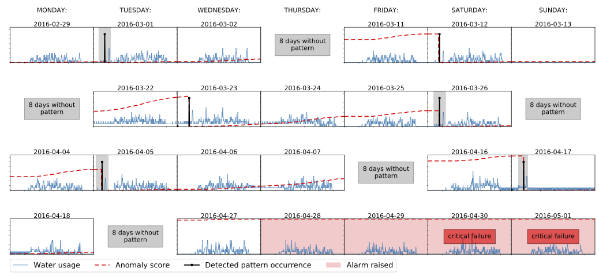



This post is based on the following publications:

- [Semi-supervised Anomaly Detection with an Application to Water Analytics](https://people.cs.kuleuven.be/~vincent.vercruyssen/publications/2019/ECMLPKDD_conference_manuscript.pdf). Vincent Vercruyssen, Wannes Meert, Gust Verbruggen, Koen Maes, Ruben Bäumer, Jesse Davis. IEEE International Conference on Data Mining. Singapore, 2018.
- [Transfer Learning for Anomaly Detection through Localized and Unsupervised Instance Selection](https://people.cs.kuleuven.be/~vincent.vercruyssen/publications/2020/AAAI_conference_manuscript.pdf). Vincent Vercruyssen, Wannes Meert, Jesse Davis. Thirty-Fourth AAAI Conference on Artificial Intelligence. New York, 2020.
- "Now you see it, now you don't!" Detecting Suspicious Pattern Absences in Continuous Time Series. Vincent Vercruyssen, Wannes Meert, Jesse Davis. SIAM International Conference on Data Mining. Cincinnati, 2020.

The results are shared in the following toolboxes: [Anomatools toolbox](https://github.com/Vincent-Vercruyssen/anomatools), [LocIT](https://github.com/Vincent-Vercruyssen/LocIT), [FZapPa](https://github.com/Vincent-Vercruyssen/absent_pattern_detection)



Anomaly detection deals with situations where mostly *normal* behaviour is observed and one is interested in detecting deviations from this normal behaviour. Examples of *abnormal* behaviour, the *anomalies*, are often not available because they are expensive to gather (e.g., breaking a machine) or they are not yet known (e.g., adversarial behaviour). Anomaly detection models typically learn what normal behaviour is based on the distribution of the data and a small number of labels proved by an expert (i.e., information about whether the observed behaviour is *normal* or *abnormal*).

Due to recent developments in Industry 4.0 and Internet-of-Things technologies, companies in all types of industries can continuously monitor all aspects of a production process and visualize them in a dashboard. Equipment is monitored using a variety of sensors, natural resource usage is tracked, and interventions are recorded. In this context, a common task is to identify anomalous behavior from the time series data generated by sensors. As manually analyzing such data is laborious and expensive, automated approaches have the potential to be much more efficient as well as cost effective. While anomaly detection could be posed as a supervised learning problem, typically this is not possible as few or no labeled examples of anomalous behavior are available and it is oftentimes infeasible or undesirable to collect them (e.g., you do not want to break an expensive machine to collect labels). Therefore, unsupervised approaches are commonly employed which typically identify anomalies as deviations from normal (i.e., common or frequent) behavior. However, in many real-world settings several types of normal behavior exist that occur less frequently than some anomalous behaviors.

Therefore, one of the DTAI research lines is focused on augmenting anomaly detection with **flexible user feedback**. We refer to this type of feedback as 'flexible' because we want to allow the user to:

- Label only part of the instances;
- Give other feedback than only labels (e.g. these instances are not the same);
- Label instances from one dataset and reuse them in another dataset (e.g. label data collected for one machine/store and use it for another one).

## Including flexible user-feedback

Anomaly detection can naturally be posed as an unsupervised learning task. Typically, unsupervised approaches exploit the underlying assumption that anomalies occur infrequently, which means they fall in low-density regions of the instance space, or that anomalies are far away from normal instances to identity them. However, real-world data regularly violate this assumption, degrading the unsupervised approaches’ performance (e.g., system maintenance can occur infrequently and irregularly, but is not anomalous). Labeled data offers the possibility to correct the mistakes made by unsupervised detectors. Unfortunately, a fully supervised approach to anomaly detection is infeasible due to the fact that collecting examples of real-world anomalies is often expensive (e.g., a machine breaking), meaning that is not a viable strategy to permit anomalous behavior for the sake of data generation. This has spurred interest in semi-supervised approaches to anomaly detection, usually in conjunction with active learning to efficiently collect the labels.

### Semi-supervised learning

Sometimes there is some information available. For example, some labels might be known or the user can answer a few question.
An approach used in our research is a constrained-clustering-based approach for anomaly detection that works in both an unsupervised and semi-supervised setting. Starting from an unlabeled data set, the approach is able to gradually incorporate expert-provided feedback to improve its performance. 

The methods presented here are implemented as part of the [Anomatools toolbox](https://github.com/Vincent-Vercruyssen/anomatools).

#### References:

- [Semi-supervised Anomaly Detection with an Application to Water Analytics](https://people.cs.kuleuven.be/~vincent.vercruyssen/publications/2019/ECMLPKDD_conference_manuscript.pdf). Vincent Vercruyssen, Wannes Meert, Gust Verbruggen, Koen Maes, Ruben Bäumer, Jesse Davis. IEEE International Conference on Data Mining. Singapore, 17 November 2018.

### Transfer Learning

Real-world anomaly detection tasks often involve monitoring numerous assets, each of which is only slightly different. Such a situation may arise when monitoring machines in a factory, resource usage in a chain of retail stores, or windturbine farms. These use cases entail monitoring a large number of assets as a big retail chain could have 100s if not 1000s of stores. Therefore, even when using a strategy like active learning, it may be impossible to collect labels for each individual asset. Given that these use cases involve multiple similar anomaly detection tasks, it may be possible to employ transfer learning to transfer labeled instances from one task to another. This could then alleviate the need to collect labels for each task separately.

Motivated by these types of applications, we developed LocIT, a transfer learning algorithm tailored towards anomaly detection. It works in two steps. First, given a partially labeled source dataset and an unlabeled target dataset, LocIT selects a subset of the labeled source instances to transfer to the target dataset. It picks those instances that have similar localized data distributions in both the source and target dataset. Second, it assigns an anomaly score using a semi-supervised nearest-neighbor approach that considers both the transferred, labeled source instances and the unlabeled target instances. 

The LocIT method is available at https://github.com/Vincent-Vercruyssen/LocIT.

#### References:

- [Transfer Learning for Anomaly Detection through Localized and Unsupervised Instance Selection](https://people.cs.kuleuven.be/~vincent.vercruyssen/publications/2020/AAAI_conference_manuscript.pdf). Vincent Vercruyssen, Wannes Meert, Jesse Davis. Thirty-Fourth AAAI Conference on Artificial Intelligence. New York, 7 February 2020.

## Types of Patterns

### Missing patterns

The standard time series anomaly detection task involves identifying portions of the data characterized by the presence of unexpected or abnormal behavior. The figure underneath (b) illustrates the canonical anomaly detection problem where the grey-shaded region highlights a pattern (i.e., a collection of points) that substantially differs from the other patterns present in the data such as the highlighted green bell-shaped pattern in Figure 1a. In contrast, this paper addresses detecting a radically different type of anomalous behavior: the absence of a pattern. The red-shaded region in the figure (c) shows a portion of the time series where we could reasonable expect to see an occurence of the bell-shaped pattern. Detecting such an anomaly is challenging as the observed measurements in the red-shaded region also correspond to typical, normal behavior in the time series.

In many real-world use cases, absent patterns often correspond to significant anomalies. The next figure shows an illustrative real-world resource monitoring use case. It involves monitoring a retail store's water usage over several weeks. The store's water distribution system contains a device that automatically performs self-cleaning. Although the water usage during a self-cleaning action is always slightly different, the highlighted segments show that a recognizable pattern emerges in the data. A failure of the cleaning action neither causes any immediate problems nor any noticeable effects in the water usage data. However, after a while a sudden breakdown will occur that halts the water distribution and a large amount of water will be disposed through an unmonitored valve. Other real-world use cases, for instance, are found in network monitoring where CPU load is used to monitor data backup operations and recurring failover system tests.

Detecting this type of anomaly requires determining when a sporadically occurring pattern is absent. Standard approaches struggle in this setting as it violates the common assumption of anomaly detection that frequent behavior is normal and infrequent behavior is abnormal. By definition, the most common behavior of the sporadically occurring pattern is absence. Furthermore, an absent pattern is not necessarily replaced by anomalous behavior.

Despite the prevalence of this type of anomaly in practice, little attention has been paid toward developing algorithms that can detect the suspicious absence of a pattern. We developed FZapPa, a data-driven algorithm that can automatically detect anomalies characterized by an absent pattern. First, FZapPa views pattern detection through the lens of learning from positive and unlabeled (PU) data. It uses a small number of example occurrences of the pattern to train a PU classifier, and the learned model is used to identify the remaining pattern occurrences. Second, FZapPa analyzes the time series to learn the relevant indirect context in which the pattern is expected to appear and models its occurrence using a probabilistic model. Based on this model, it then predicts an anomaly score to detect absent occurrences. 

FZapPa is available at: https://github.com/Vincent-Vercruyssen/absent_pattern_detection

#### References

- "Now you see it, now you don't!" Detecting Suspicious Pattern Absences in Continuous Time Series. Vincent Vercruyssen, Wannes Meert, Jesse Davis. SIAM International Conference on Data Mining. Cincinnati, 7 May 2020.

