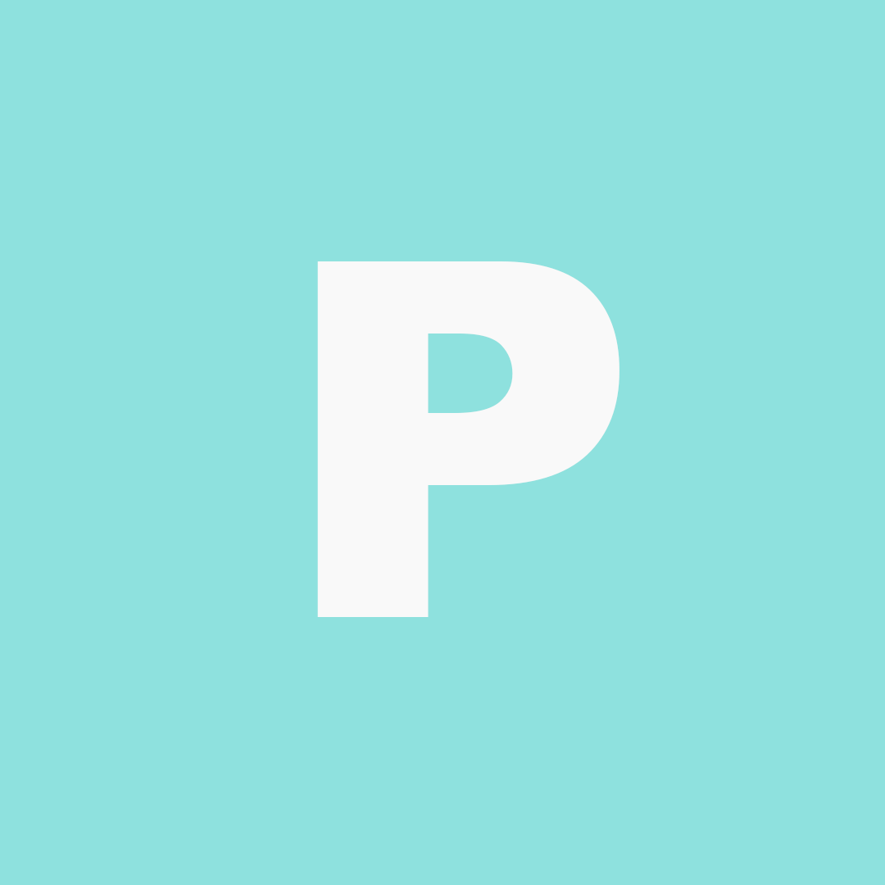

# A post

This is an example of a post with the Academic theme. We can use **markdown** to write the content and 

add stuff.

### Tables

We can easily add tables using markdown syntax and html

|                   | Accuracy | Precision | Recall | F1    |
| ----------------- | -------- | --------- | ------ | ----- |
| L                 | 83,4     | 86,0      | 79,4   | 82,6  |
| P                 | 84,5     | 85,8      | 82,5   | 84,1  |
| U                 | 82,3     | 80,3      | 85,4   | 82,8  |
| L+P P+U U+P | ~87,5    | ~88,5     | ~86,0  | ~87,2 |
| L+P+U             | 89,1     | 89,6      | 88,3   | 89,0  |

### Images

Markdown allows to add images to your posts like this one

## Tags

Below you can find the tags that are specified in the header of the page and the list of related project and posts which is automatically generated.