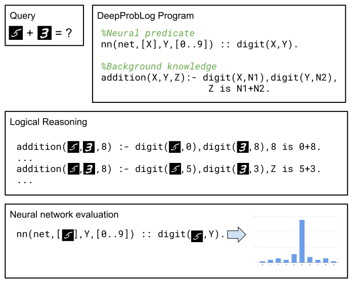
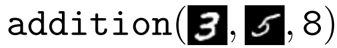
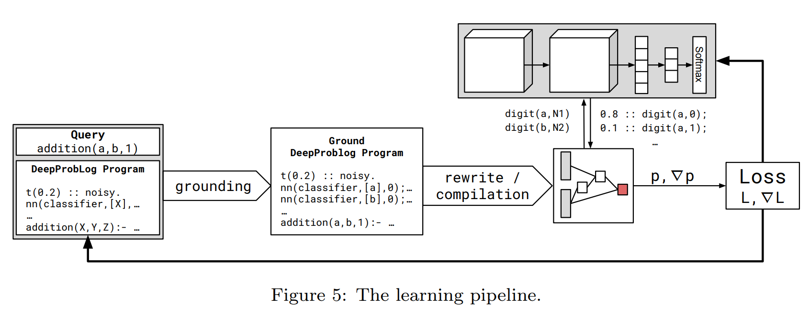

This is a brief overview of DeepProbLog, a neuro-symbolic framework that integrates the probabilistic logic programming language ProbLog with neural networks.
The full paper can be found [here](https://arxiv.org/abs/1907.08194).


## What is DeepProbLog?

DeepProbLog is an extension of ProbLog that integrates neural networks through the concept of the neural predicate. It allows us to combine high-level logical reasoning with the sub-symbolic power of neural networks.



Let's say we want to solve the following problem. We get two handwritten digits (MNIST) and have to determine its sum, e.g. 

This task can be easily handled in DeepProbLog:

```
nn(mnist_classifier,[X],Y,[0..9]) :: digit(X,Y).
addition(X,Y,Z) :- digit(X,N1), digit(Y,N2), Z is N1+N2.
```	
Where the first line is a *neural predicate* that includes a neural network as a predicate inside of the logical program. This neural network can be trained.
The addition predicate defines the sum of the individual digits. We can now train this DeepProbLog model and all of the neural networks inside of it using examples of additions. It's important to note that the neural networks will, thanks to the logic, learn to recognize individual digits.


The main strengths of DeepProbLog are:

- It combines probabilistic reasoning, logical reasoning and the power of neural networks.
- It can train neural networks and learn probabilistic paramters from examples.
- We retain both logic and neural networks as edge cases.




## Results

#### MNIST addition

We compared the MNIST addition example describe above with a convolutional neural network baseline.
The result shows that the inclusion of the logic allows the model to train quicker and achieve a higher accuracy. It's also important to note that the neural network trained inside the DeepProbLog model can recognize single digits, whereas the convolutional baselines can only classify sums. The separation between the logic and neural aspects results in a more flexible model.


#### Sketching

We reimplemented the experiments from the Differentiable Forth paper. These use a sketching approach to learn the missing behaviour from partial programs using small neural modules.

From the result we can see that we perform similar to the original (neural) model. For learning to sort lists, Differentiable Forth starts to struggle starting from length 4. This is due to the long program trace. DeepProbLog does not have this problem thanks to the fact that it can perform almost all of the program in the logic.

