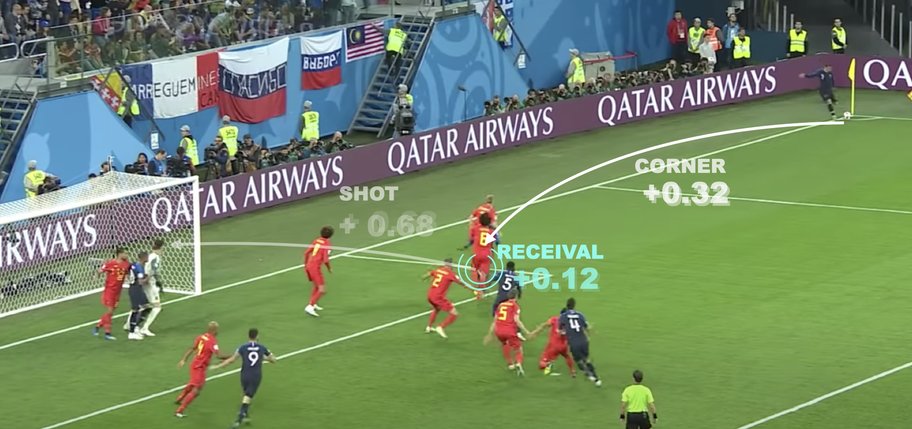

VAEP (Valuing Actions by Estimating Probabilities) is a framework for valuing player actions in soccer. It assigns a value to each on-the-ball action in event stream data based on its impact on the game outcome while accounting for the context in which the action happened. In the series of blog posts below, we explain the methodology behind VAEP, how VAEP relates to other similar frameworks and use it to analyse a season of the English Premier League and Belgian Jupiler Pro League.



#### EXPLORING HOW VAEP VALUES ACTIONS

This blog post introduces an interactive visualization that explains the
methodology behind VAEP and a tool to explore how VAEP values player actions in
soccer.

See the full post at https://dtai.cs.kuleuven.be/sports/blog/exploring-how-vaep-values-actions   
The interactive can be viewed at https://dtai.cs.kuleuven.be/sports/vaep





#### INTRODUCING ATOMIC-SPADL: A NEW WAY TO REPRESENT EVENT STREAM DATA

This blog post discusses Atomic-SPADL -- an alternative data representation for
soccer event stream data -- and how it affects learning models like VAEP.

See the full post at https://dtai.cs.kuleuven.be/sports/blog/introducing-atomic-spadl:-a-new-way-to-represent-event-stream-data




#### A CRITICAL COMPARISON OF XT AND VAEP

This blog post contextualizes VAEP within the existing work and discusses how
it differs from ball-progression frameworks such as xT.

See the full post at https://dtai.cs.kuleuven.be/sports/blog/valuing-on-the-ball-actions-in-soccer:-a-critical-comparison-of-xt-and-vaep





#### OUR THOUGHTS ON AMERICAN SOCCER ANALYSIS' G+ METRIC

Continuing on the blog post above, this post discusses how VAEP differs from American Soccer Analysis' g+ metric

See the full post at https://dtai.cs.kuleuven.be/sports/blog/our-thoughts-on-american-soccer-analysis'-g+-metric





#### A DATA-DRIVEN REVIEW OF THE FIRST PREMIER LEAGUE HALF

A short analysis of the first half of the 2019/2020 Premier League season to
identify the best team, the best signings, the rising talents and some of the highest-rated passes.

See the full post at https://dtai.cs.kuleuven.be/sports/blog/a-data-driven-review-of-the-first-premier-league-half





#### EEN TERUGBLIK OP DE JUPILER PRO LEAGUE

An analysis of the 2019/2020 season of the Belgian Jupiler Pro League. We
discuss how teams evolved during the season, which players performed best and
identify the most exciting games.

See the full post (in Dutch) at https://dtai.cs.kuleuven.be/sports/blog/een-terugblik-op-de-jupiler-pro-league


