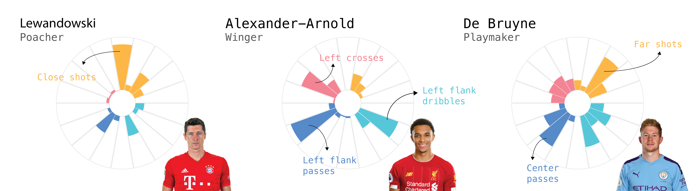



We give an intuitive explanation of our recent ECMLPKDD 2019 paper on characterizing soccer players’ style of play based on event stream data, provide illustrative use cases and release a small interactive demo.

See the full post at https://dtai.cs.kuleuven.be/sports/blog/player-vectors-characterizing-soccer-players-playing-style  
A demo is available at https://dtai.cs.kuleuven.be/sports/player_vectors



