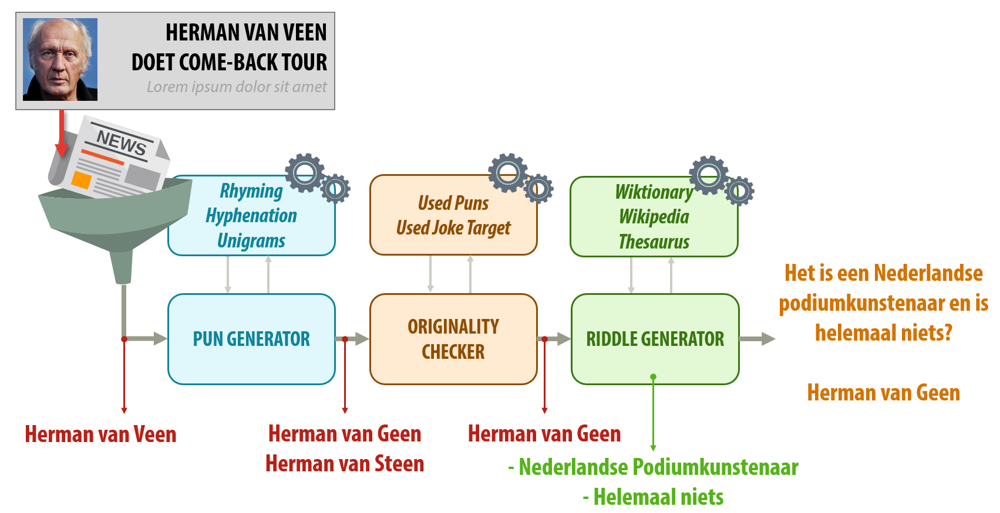

### Computational humor

Can computers be funny?
Certainly your virtual assistant (e.g. *Siri* or *Alexa*) is able to tell a joke if you ask for one, but these are of course pre-written, human-made jokes.
One might wonder if are computers already advanced enough to understand how to construct good jokes.
And if they could write jokes, could they do this in any language and about any topic?

Many researchers have already looked into humor generation algorithms.
Recent popular neural networks approaches seem to indicate that
writing good jokes is [still far off](https://towardsdatascience.com/teaching-gpt-2-a-sense-of-humor-fine-tuning-large-transformer-models-on-a-single-gpu-in-pytorch-59e8cec40912).
Most of the funny things computers create using neural networks, [seem to mostly occur on accident](https://aiweirdness.com/books).

Further in the past, however, more symbolic approaches have been used to generate subjectively better jokes.
Researchers created programs to for example [generate punning riddles](http://joking.abdn.ac.uk/webversion/welcome.php),
[create analogy jokes](http://www.infoivy.com/2013/09/big-data-what-joke-generator-that-is.html)
and [detect double entendres](https://www.popsci.com/technology/article/2011-04/thats-what-she-said-software-recognizes-pervy-double-entendres-automatically/).
These programs usually define some rules that constitute a funny joke, and then fill in the slots randomly.
For example, the [STANDUP punning riddle generator]((http://joking.abdn.ac.uk/webversion/welcome.php)) might generate a joke like:

> What is the difference between a pretty glove and a silent cat?
>
> One is a cute mitten, the other is a mute kitten.

To create such a joke, the generator uses templates.
Template can be seen as sentences with holes, which are later filled in by following certain rules.
For example, for the above joke, the template would be the same as the joke, but without the words *pretty*, *glove*, *silent*, *cat*, *cute*, *mitten*, *mute* and *kitten*:

> What is the difference between a **A** **B** and a **C** **D**?
>
> One is a **E** **F**, the other is a **G** **H**.

These holes are then related to each other using rules, which then fill the holes with appropriate words.
For example: **E** and **G** should end with the same sound, and so should **F** and **H**.
Similarly, **E** and **H** have to start with the same sound, and so do **F** and **G**.
To create the question of the riddle, four pairs of synonyms are required, namely **A** should be a synonym of **E**, **B** of **F** and so on.
In a way, the generator is playing [Mad Libs](http://www.madlibs.com/) with itself, but enforcing slightly more logic in the relations between the words.
  
### Teaching joke patterns
  
So while it might be hard to make a computer come up with a broad range of clever jokes completely from scratch,
 we can teach them how to generate specific types of jokes.
However, not all language have the rich corpora available to pull this off, like the English language does.
Another problem is that most joke generators use static data sources, and are thus unable to create jokes about topics that are not included in this data, unless they are manually updated.
Old joke generators might thus not be able to make jokes about new music artists or politicians.

We created [bot](https://twitter.com/MopjesBot) for generating Dutch "Kermit de Kikker" punning riddles, using limited Dutch language resources,
namely [Wikipedia](https://nl.wikipedia.org/), a [thesaurus](https://www.mijnwoordenboek.nl/synoniem.php) (or [Wiktionary](https://nl.wiktionary.org/wiki/Hoofdpagina)),
[rhyming dictionary](https://www.mijnwoordenboek.nl/rijmwoordenboek/) and [hyphenation](https://www.ushuaia.pl/hyphen/?ln=nl).
All these resources tend to be available online for most languages.
The classic *"Kermit de Kikker"* (*Dutch for [Kermit the Frog](https://en.wikipedia.org/wiki/Kermit_the_Frog)*) joke is based on finding rhymes of *Kikker*,
and suggesting in the riddle what word the listener should look for.
For example:

> Het is groen en het plakt?
>
> Kermit de Sticker

Which is usually followed by a large succession of similar jokes about Kermit, e.g.

> Het is groen en is pyromaan?
>
> Kermit de Fikker

As you probably see, this is something we can teach computers to generate for us.
But why stick with only *Kermit de Kikker* when you can insert any name?
Given the name *Kanye West* as input, it would perform the following steps:

1. [Find a rhyme](https://www.rhymezone.com/r/rhyme.cgi?Word=west&typeofrhyme=perfect&org1=syl&org2=l&org3=y)
on the last word with the same number of syllables, e.g. *rest* .
If it has multiple syllables, look for rhymes on any combination of consequent syllables.
Prefer more common words using a word frequency list, if this is available in the language of choice.

2. Replace the relevant syllables of the input name with the rhyme word, e.g. Kanye Rest.

3. Use [Wikipedia](https://wikipedia.org) to find a nice description of the entity with the input name.
This is not that hard to find, since Wikipedia page entries usually start with *\[page_name\] **is** \[explanation\]*.
By taking the part after the *"to be"* verb, and until any punctuation or start of clause, the program can distill a brief description.
For example, it would describe [Kanye West](https://en.wikipedia.org/wiki/Kanye_West) as *an American rapper*.

4. It now only has to describe the rhyme word to complete the pun riddle.
To achieve this, either a [thesaurus](https://www.thesaurus.com/browse/rest) (for short descriptions),
or segments from [Wiktionary](https://en.wiktionary.org/wiki/rest) (for longer, more interesting descriptions) could be used.
The algorithm should however make sure that the description do not contain the word to guess itself, since that would spoil the fun.
The word frequency table could also be used to choose less common (and thus more specific) descriptive words.
For example, it could describe *rest* as *"relief from work"*.

5. Now it can fill all these words into the the template, to create the following joke:
> It's an American rapper and is relief from work?
>
> Kanye Rest

These jokes tend to become more interesting once you have multiple of them, as they turn into a fun guessing game.
Luckely, given that we completely automated the generation process, the described program can easily generate many more jokes about this person.

We build a Twitterbot,called [MopjesBot](https://twitter.com/MopjesBot), that generates five unique jokes using this schema on a daily basis.
It first checks the news for articles, then filters out articles about too sensitive topics, and finally picks the name that occurs most in these articles.
The steps it follows to generate these jokes are summarised in the diagram below:

This system is thus able to generate jokes following a specific template and schema,
but also nudges the jokes to have a higher probability of having certain characteristics (e.g. common or less common words in certain template "holes").
  
### Learning what constitutes a joke

While it's great that we can already make computers generate jokes using templates and schemas, implementing these require a large amount of human effort.
It's not really the machine gaining insights into humor, but rather the human giving the machine explicit insights into a specific type of joke.

So, could it learn these insights by itself?
That's one task we want to tackle in the future, which can be subdivided in multiple parts:
  - can we automatically extract relations between words
  - can we then find out which are better by learning probabilities, with similar "nudging" functions?
  
The former is something we have [explored in the past](https://www.researchgate.net/publication/325432136_Automatic_Joke_Generation_Learning_Humor_from_Examples), and are still actively investigating.
The latter task could be achieve using preference learning.
[Preference learning](https://en.wikipedia.org/wiki/Preference_learning) is a task where given a set of two data points, the algorithm has to guess which one is prefered by a human.
For this, a human first has to specify for many examples which one out of two possibilities they prefer.
By just joining the attributes of the two data points and adding 0 if the left one is prefered and 1 otherwise, this become a binary classification problem.
The trained model is then a comparator that can be used to sort lists of these data points, if the type of model is chosen correctly.

For our case, this would mean that a model would learn which out of two jokes (or parameters to construct a joke) it would prefer.
Since we know the rules constructing this joke, we could then derive information about which rules are causing better jokes in what situations.

However, this is all still work for in the future.
For now, we will have to just keep on writing the joke generators ourselves, or just listen to pre-written jokes told by Siri.
