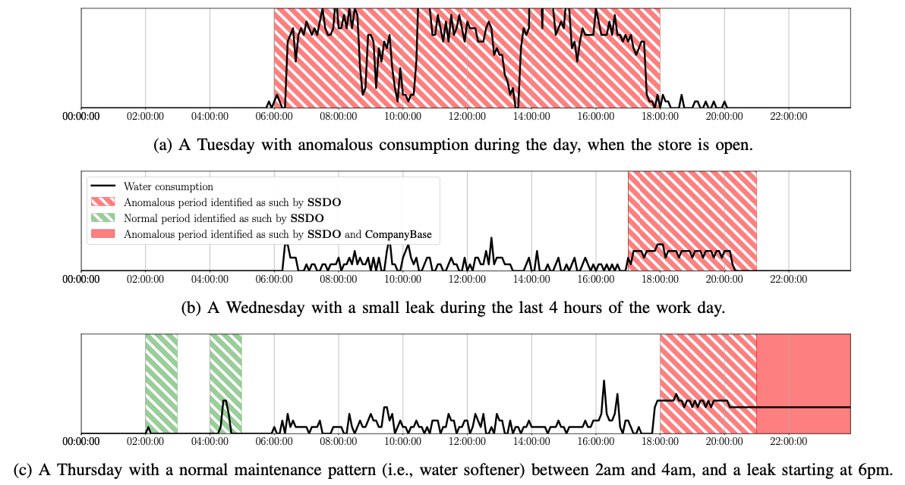

Anomaly detection deals with situations where mostly 'normal' behaviour is observed and one is interested in detecting deviations from this normal behaviour. Often negative labels, or anomalies, are not available because they are expensive (e.g. break a machine) or unknown (e.g. adversarial behaviour). Anomaly detection method typically learn from the distribution of data and a small number of labels to include expert knowledge.

Nowadays, all aspects of a production process are continuously monitored and visualized in a dashboard. Equipment is monitored using a variety of sensors, natural resource usage is tracked, and interventions are recorded. In this context, a common task is to identify anomalous behavior from the time series data generated by sensors. As manually analyzing such data is laborious and expensive, automated approaches have the potential to be much more efficient as well as cost effective. While anomaly detection could be posed as a supervised learning problem, typically this is not possible as few or no labeled examples of anomalous behavior are available and it is oftentimes infeasible or undesirable to collect them. Therefore, unsupervised approaches are commonly employed which typically identify anomalies as deviations from normal (i.e., common or frequent) behavior. However, in many real-world settings several types of normal behavior exist that occur less frequently than some anomalous behaviors.

The methods presented in this article are implemented as part of the [Anomatools toolbox](https://github.com/Vincent-Vercruyssen/anomatools).

## Including flexible user-feedback

### Semi-supervised learning

In this paper, we propose a novel constrained-clustering-based approach for anomaly detection that works in both an unsupervised and semi-supervised setting. Starting from an unlabeled data set, the approach is able to gradually incorporate expert-provided feedback to improve its performance. We evaluated our approach on real-world water monitoring time series data from supermarkets in collaboration with Colruyt Group, one of Belgiums largest retail companies. Empirically, we found that our approach outperforms the current detection system as well as several other baselines. Our system is currently deployed and used by the company to analyze water usage for 20 stores on a daily basis.

References:

- [Semi-supervised Anomaly Detection with an Application to Water Analytics](https://people.cs.kuleuven.be/~vincent.vercruyssen/publications/2019/ECMLPKDD_conference_manuscript.pdf). Vincent Vercruyssen, Wannes Meert, Gust Verbruggen, Koen Maes, Ruben Bäumer, Jesse Davis. IEEE International Conference on Data Mining. Singapore, 17 November 2018.

### Transfer Learning

References:

- [Transfer Learning for Anomaly Detection through Localized and Unsupervised Instance Selection](https://people.cs.kuleuven.be/~vincent.vercruyssen/publications/2020/AAAI_conference_manuscript.pdf). Vincent Vercruyssen, Wannes Meert, Jesse Davis. Thirty-Fourth AAAI Conference on Artificial Intelligence. New York, 7 February 2020.

## Types of Patterns

### Missing patterns

- "Now you see it, now you don't!" Detecting Suspicious Pattern Absences in Continuous Time Series. Vincent Vercruyssen, Wannes Meert, Jesse Davis. SIAM International Conference on Data Mining. Cincinnati, 7 May 2020.

