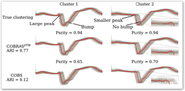

Clustering is one of the most widely used techniques for time series because it allows to identify and summarize patterns that are of interest (e.g., frequent or anomalous patterns). Furthermore, it does not rely on costly human supervision of time-consuming labeling.
As a result, time series clustering has been studied for many different applications such as astronomy, biology, meteorology, medicine, finance, robotics, engineering, etc..

## Unsupervised Clustering: DTW

Time series clustering is heavily dependent on the choice of the distance used to compare two series. Typically, one is interested in similarity between shapes represented by a series, irrespective of phase or amplitude. And while many distance measures have been proposed, it has been shown that distance measures that can deal with invariances to amplitude and phase perform particularly well.
One of the best performing similarity measures is Dynamic Time Warping (DTW).

The resulting clustering is robust against small changes between time series. As can be seen in the figure underneath, DTW allows a clustering that nicely groups similar series.

The toolbox is available at https://github.com/wannesm/dtaidistance/ .

## Semi-supervised Clustering: COBRAS

Clustering is ubiquitous in data analysis. There is a large diversity in algorithms, loss functions, similarity measures, etc. This is partly due to the fact that clustering is inherently subjective: in many cases, there is no single correct clustering, and different users may prefer different clusterings, depending on their goals and prior knowledge [17]. Depending on their preference, they should use the right algorithm, similarity measure, loss function, hyperparameter settings, etc. This requires a fair amount of knowledge and expertise on the user's side.
Semi-supervised clustering methods deal with this subjectiveness in a differ- ent manner. They allow the user to specify constraints that express their subjective interests. These constraints can then guide the algorithm towards solutions that the user finds interesting. Many such systems obtain these constraints by asking the user to answer queries of the following type: should these two elements be in the same cluster? A so-called must-link constraint is obtained if the answer is yes, a cannot-link otherwise. In many situations, answering this type of questions is much easier for the user than selecting the right algorithm, defining the similarity measure, etc. Active semi-supervised clustering methods
aim to limit the number of queries that is required to obtain a good clustering by selecting informative pairs to query.
In the context of clustering time series, the subjectiveness of clustering is even more prominent. In some contexts, the time scale matters, in other contexts it does not. Similarly, the scale of the amplitude may (not) matter. One may want to cluster time series based on certain types of qualitative behavior (monotonic, periodic, ...), local patterns that occur in them, etc. Despite this variability, and although there is a plethora of work on time series clustering, semi-supervised clustering of time series has only very recently started receiving attention.

Clustering is ubiquitous in data analysis, including analysis of time series. But it is inherently subjective: different users may prefer different clusterings for a particular dataset. Semi-supervised clustering addresses this by allowing the user to provide examples of instances that should (not) be in the same cluster. 

The COBRAS-TS algorithm is a semi-supervised clustering method that can use indirect feedback from users. It clusters with the user in the loop. The user can provide indirect feedback where it is only required to tell the system for a few time series whether two time series represent the same behavior or not. As a result the COBRAS-TS system can identify clusters that are characterized by small local patterns.

An interface is provided to the user that actively asks for feedback about time series where the method is the most unsure about how to cluster them.

The toolbox is available at https://dtai.cs.kuleuven.be/software/cobras/ .

